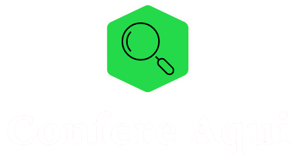
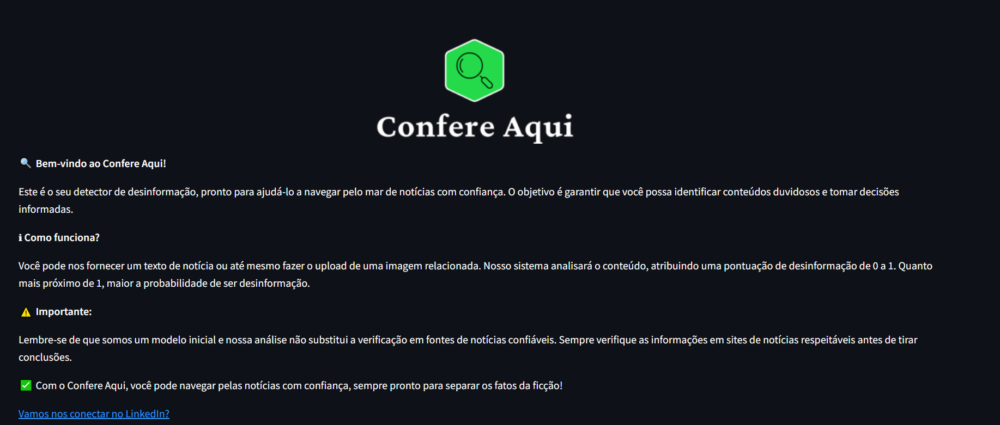
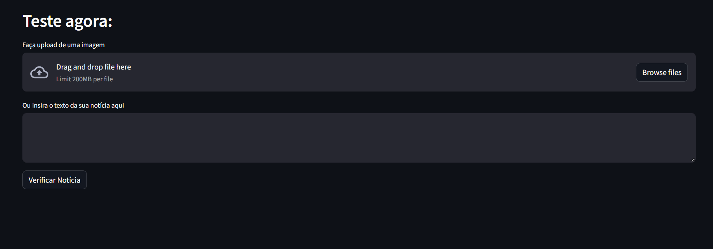

O Confere Aqui é uma ferramenta para distinguir fatos e fake news. Treinado para analisar imagens e texto, este detector fornece uma avaliação precisa do nível de desinformação presente no conteúdo, além de oferecer evidências sólidas para validar suas conclusões.

Construído originalmente no ambiente Colab em Python, o Confere Aqui foi adaptado para o framework Streamlit, permitindo sua utilização em tempo real.

Utilizando em sua base o modelo Gemini 1.5 Pro, este detector é capaz de analisar informações em tempo real e gerar respostas confiáveis.

### Imagem da ferramenta

### Uso da ferramenta

## Funcionalidades
O sistema atribui uma pontuação de desinformação de 0 a 1, indicando a probabilidade de o conteúdo ser classificado como desinformação. Além disso, fornece evidências detalhadas para contextualizar a veracidade do conteúdo, oferecendo uma visão abrangente para o usuário.

## Quer testar?
Acesse a ferramenta Confere Aqui 🔍 no link abaixo:

Este programa experimental foi desenvolvido como parte do Desafio Imersão IA Alura 2024.
